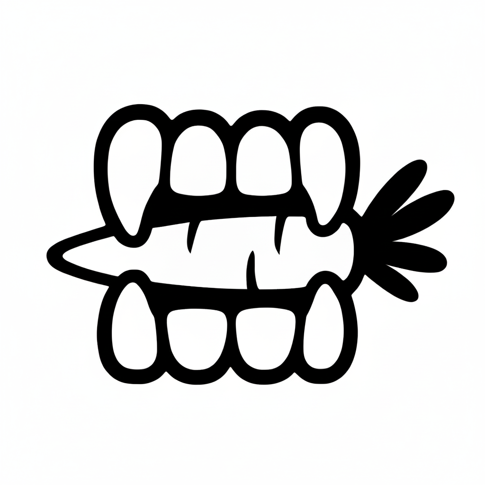

<!DOCTYPE html>
<html lang="pt-BR">
<head>
    <meta charset="UTF-8">
    <meta name="viewport" content="width=device-width, initial-scale=1.0">
    <title>Canibal</title>
    <link rel="stylesheet" type="text/css" href="./css/style.css">
</head>
<body>
    

    <h1>Canibal</h1>
    
    

    

    
Canibal não é apenas um nome, é uma declaração ousada que subverte o tradicional para celebrar a vida e a natureza. Nosso restaurante é um refúgio para os amantes da culinária vegana e vegetariana, onde a arte de comer bem se encontra com o respeito pelo planeta. Com um cardápio vibrante e inovador, transformamos ingredientes frescos e sazonais em pratos que explodem em sabor, cor e textura. No Canibal, a única coisa que devoramos são os mitos de que a comida sem carne não pode ser deliciosa, surpreendente e totalmente satisfatória. Junte-se a nós nesta revolução culinária e descubra o verdadeiro banquete que a terra tem a oferecer. 
    

    

    <ul>
        

        <li>Ingredientes frescos vindos da própia Horta do Canibal!
        </li>
        <li>Ambiente acolhedor</li>
        <li>Preços acessiveís</li>
    </ul>

   
    <a href="cardapio.html">
    <button >Cardápio</button> 
</a>
<a href="contato.html">
<button>Contato</button>
</a>
</body>
</html>
